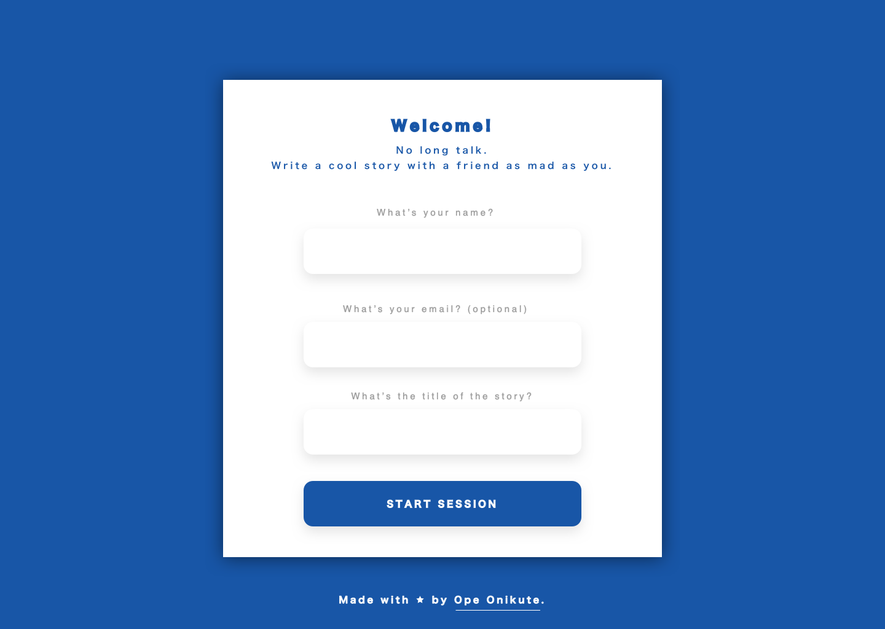
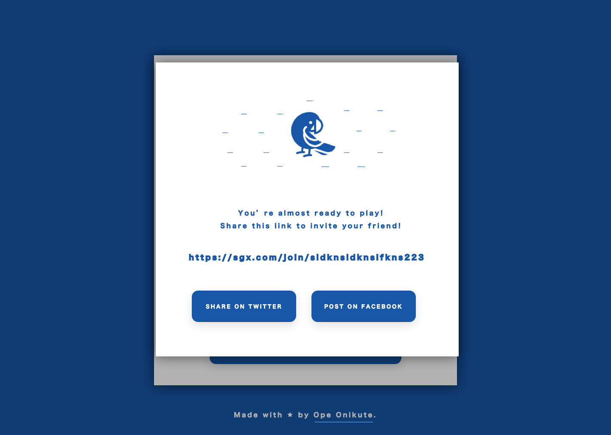
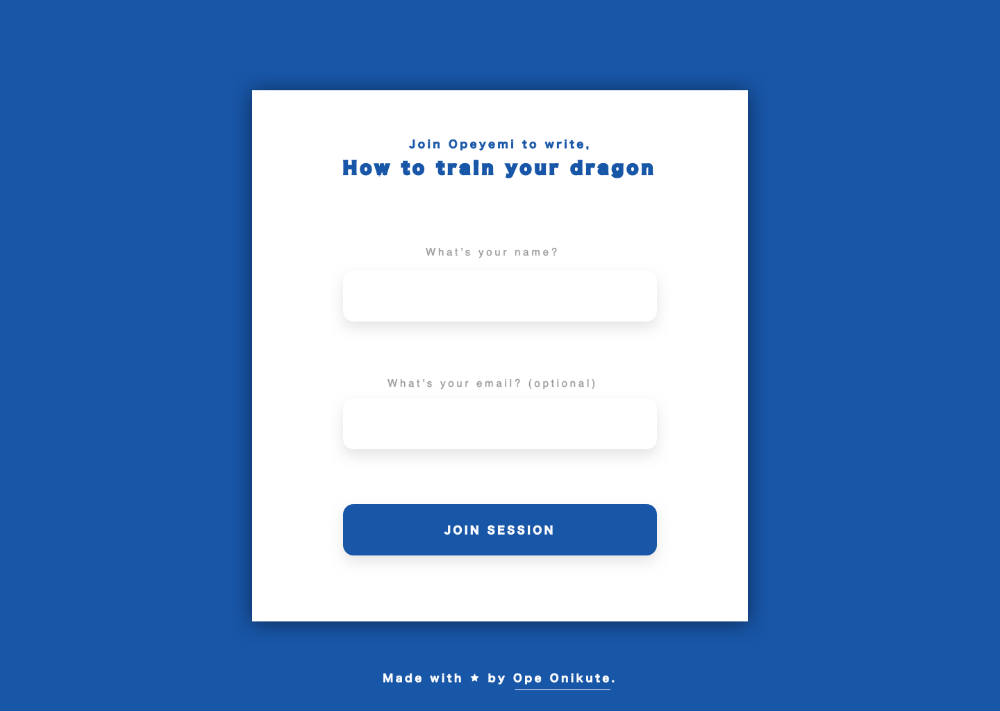
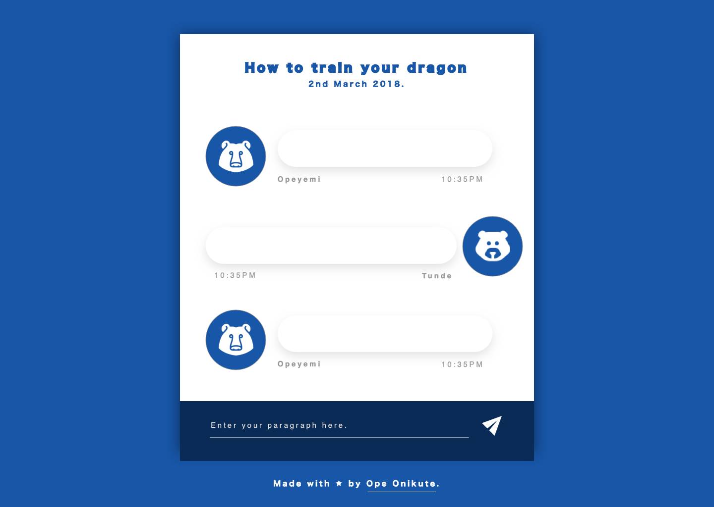
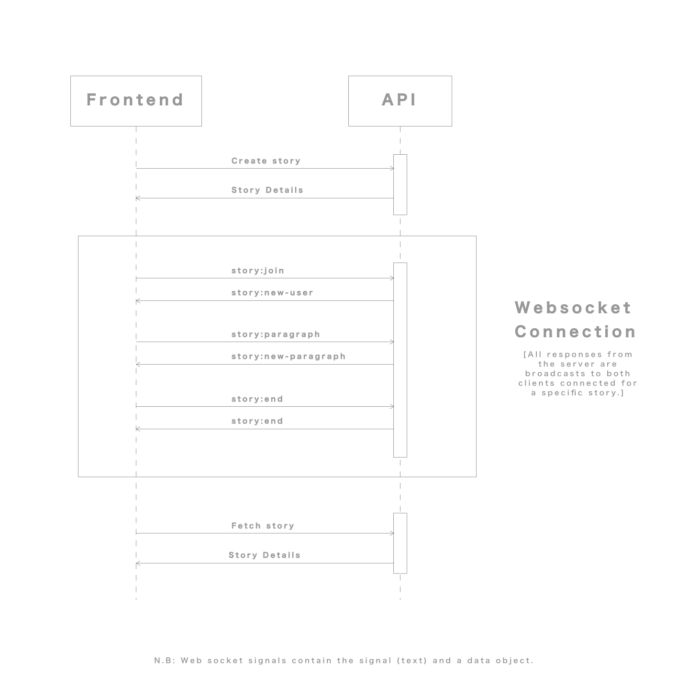

# Story game specification document

## Overview

The idea for this game is to deploy a two-player, text-based game in which users take turn in writing paragraphs of a story and spits out the story all formatted and shii.

This specification is my attempt to document how the story game should work in general. From game flow, to more technical specifications like software stack etc.

I will attempt to take a deep-dive, using the [12factor app spec](12factor.net) as a guide.

Implementation can be found [here](https://github.com/OpeOnikute/sgx).

## Game flow

**_Player one_** - Story owner.
**_Player two_** - Accomplice.

- Player one starts the game. Enters title of story and his/her name.
- Player one then shares a link to join the game.
- Player two joins the game.
- Each player gets one minute un-restricted to type in a paragraph (\*)
- If a player hasn't entered non-empty text after the full minute, the other player gets his own next minute (\*)
- When players are done, player one can decide to end.
- The title can be modified at the end. This is because players don't usually know what they wanna write before it starts.
- When the game ends, the system provides box that contains the entire story, formatted in paragraphs.
- Player one can then:
  - edit the content of that box
  - copy the text out
  - share a link to the story (on Twitter and Facebook)
  - print out as pdf (and Word?)

**Meta**

- Title can be edited throughout the session.
- Items marked with (\*) at the end are not exactly neccessary.

## Components

2 main components - API and Frontend.

Components are seperated on a code level, not on an infrastructure level.

### Frontend

UI inspired by [Fitness app chatbot ui ux
by Virgil Pana](https://dribbble.com/shots/3850121-Fitness-app-chatbot-ui-ux).

**Behaviour**

- Provides the interface for users to play.
- Assigns a user a random animal image when they join.
- Regulates the session and decides whose turn it is to play.
- Only switches turns if the player is not currently typing.
- Concatenates the story on each user entry and sends updates to the API in 3-minute intervals.
- Sends final update when the game ends.

**Stack**

- React

**Screens**

- New story





- Join story



- Collaborate



- View story (final screen)


### API

**Behaviour**

- Handles authentication (if any)
- Database reads & writes
- Exposes data through REST endpoints.
- Storing each entry with meta data of who wrote it.
- Uses player IDs, not names, for identification.

**Stack**

- NodeJS with Express or Go

**Endpoints**

- Create story session (POST) - Player one name & email.
- Join session (PUT) - `Player two name`
- Add new paragraph - `Player id & text`
- Save Story (PUT)
- View Story (GET)

**Story Data Structure Example**

```
list = [
    {"user": "<player1-id>", "text": "There was a man with big balls."},
    {"user": "<player2-id>", "text": "He spent time making them dance."},
    {"user": "<player1-id>", "text": "He was eventually arrested for sexual assault."}
]

//Output
There was a man with big balls.
He spent time making them dance.
He was eventually arrested for sexual assault.

Story by: <player1-name> & <player2-name>
```

### Communication Specs

This is an attempt to define how the client and server should interact throughout the lifecycle of the game. The use of websockets during actual game-play makes it less straightforward than calling REST endpoints directly.



**Websocket Signals**

| Signal              |  Client  |                                      Description |                              Data |
| ------------------- | :------: | -----------------------------------------------: | --------------------------------: |
| story:join          | Frontend | Join a story. Works for both owner and player 2. |          `playerName,playerEmail` |
| story:new-user      |   API    |       Informs connected clients of a new player. | `playerID,playerName,playerEmail` |
| story:paragraph     | Frontend |                            Adds a new paragraph. |                `playerID,content` |
| story:new-paragraph | Frontend |    Informs connected clients of a new paragraph. |                `playerID,content` |
| story:end           | Frontend |        Sends request to end the session (Owner). |                        `playerID` |
| story:end           | Frontend |  Informs connected clients of the session's end. |                                   |

N.B: There's no need to pass the story ID in WS requests cause the WS connection is already segmented based on the story.

### External Services

- **Real-time connection** - Web socket API endpoint.

### Action Points

- Select a better name.
